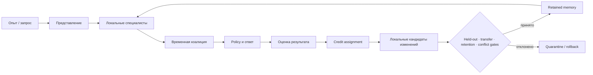
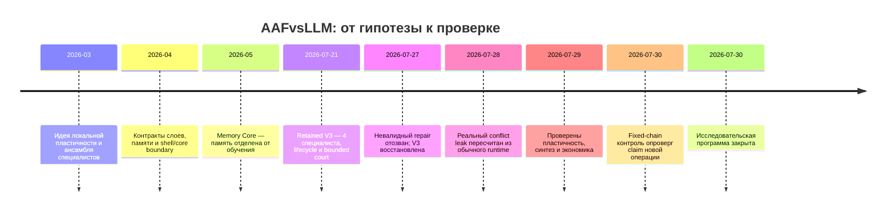

# AAFvsLLM — исследование обучения через специалистов

[English summary](README_EN.md)

> **Статус:** исследовательская программа завершена 30 июля 2026 года
>
> **Результат:** построена управляемая модульная система знаний; исходная
> гипотеза новой интеллектуальной модели не подтверждена
>
> **Публикация:** история, архитектура и проверяемые evidence-capsules открыты;
> код системы и глубокие reproduction-пакеты — по отдельному запросу

## Сразу о названии, авторе и масштабе

**AAF** — внутреннее рабочее имя исследовательской архитектуры. В исходных
материалах не была зафиксирована единая официальная английская расшифровка,
поэтому публикация не придумывает её задним числом. `vsLLM` обозначало проверку
идеи дополнительной обучающей архитектуры рядом с базовой языковой моделью, а
не соревнование готовых продуктов.

Проект вёл **Alex Zak** под GitHub-аккаунтом **RochinTest**. Это был сольный
исследовательский проект с применением LLM и Codex как инструментов анализа,
программирования и проверки. Основной цикл, отражённый в публичной хронологии,
длился с марта по июль 2026 года. Архитектурные решения, критерии принятия и
решение о закрытии оставались ответственностью владельца проекта.

## Что система делала на практике

В рабочем варианте AAF не была одной новой нейросетью. Это был программный
контур вокруг базовой модели:

1. обычный запрос сначала обрабатывал базовый контур;
2. ограниченные **специалисты** могли предложить факт или локальное действие;
3. **арбитр** должен был собрать все относящиеся к запросу утверждения,
   обнаружить конфликт и выбрать ответ либо отказаться;
4. прошедшие проверки знания и модули упаковывались как версионированные
   **retained units**;
5. Memory Core, registry, quarantine и rollback управляли их сохранением,
   активацией и удалением;
6. после перезапуска проверялось, сохранилось ли новое поведение и не сломалось
   ли старое.

Простой пример: специалист по отношению `author` мог предложить ответ на вопрос
об авторе книги вместе с источником. При двух несовместимых ответах арбитр
должен был вернуть отказ, а не выбрать первый найденный факт. Именно проверка
такого обычного runtime-пути позднее обнаружила реальный conflict leak.

Короткие определения терминов: [словарь](docs/GLOSSARY.md). Подробная схема:
[обзор архитектуры](docs/02_ARCHITECTURE_OVERVIEW.md).

## Проверить опубликованные данные прямо сейчас

Материалы физически находятся в этом репозитории; GitHub может скрывать часть
файлов за кнопкой **View all files**, поэтому ниже даны прямые ссылки:

- [автономный verifier](verify_public_evidence.py);
- [SHA-256 manifest](evidence/public/manifest.json);
- [целостность retained V3](evidence/public/v3_integrity.json);
- [характеризация конфликтов](evidence/public/conflict_characterization.json);
- [пластичность и экономика](evidence/public/three_questions.json);
- [проверка невыразимости заявленного синтеза](evidence/public/nonexpressibility.json);
- [описание evidence-capsules](evidence/README.md);
- [реестр утверждений и границ доказательств](docs/EVIDENCE_LEDGER.md).

Локальный пересчёт:

```bash
git clone https://github.com/RochinTest/AAFvsLLM-public-report.git
cd AAFvsLLM-public-report
python3 verify_public_evidence.py
```

Verifier использует только Python standard library, не обращается к сети и не
принимает готовые итоговые статусы как доказательство. Публичный набор не
является полной независимой репликацией: в нём нет приватного runtime, всех raw
court rows и полного исторического архива. Эти ограничения перечислены в
[методе и ограничениях](docs/08_METHOD_AND_LIMITATIONS.md).

## Один главный вопрос

Большая языковая модель в основном отвечает: «что уже заключено в моих
параметрах и текущем контексте?» AAF ставила другой вопрос:

> Как машина должна измениться после опыта, закрепить полезное локально,
> сохранить старые способности и затем применить новое в другой ситуации?

Проект исследовал систему, в которой знания и поведение распределены между
специалистами, итог собирает ансамбль, вклад участников получает причинную
оценку, а успешные изменения проходят проверку перед долговременным
закреплением.

## Короткий ответ

AAF дошла значительно дальше идеи на бумаге: появились Memory Core,
типизированные факты с происхождением, retained-специалисты, арбитраж
утверждений, deny-by-default запись, quarantine, rollback и версионированный
пакет V3. Но система не показала главного отличия от обычной инженерии знаний:
полезной перестройки общего пространства представлений и рождения новой
операции внутри коалиции.

| Уровень утверждения | Итог |
|---|---|
| Управляемый пакет ограниченных специалистов | Реализован и узко проверен |
| Воспроизводимое восстановление retained V3 | Подтверждено для целостности пакета |
| Безопасность всех конфликтов в normal runtime | Не доказана; найден реальный leak |
| Полезная общая пластичность | Не поддержана имеющимся witness |
| Новая операция, созданная coalition | Опровергнута для решающего witness |
| Экономическое преимущество над rule/RAG/prompt/fine-tuning | Не установлено |
| Новая интеллектуальная модель | Не подтверждена |

## Что было построено



Это была целевая схема. Разные части достигли разной зрелости. Представление,
координация, память и governance получили работающие инженерные реализации;
автономное появление новых обобщаемых операций — нет.

Подробнее: [идея и цели](docs/01_IDEA_AND_GOALS.md) ·
[архитектура](docs/02_ARCHITECTURE_OVERVIEW.md) ·
[словарь](docs/GLOSSARY.md)

## Retained V3 — важный промежуточный результат

V3 была не «третьей моделью», а content-addressed пакетом ограниченных
специалистов:

- 4 specialist-программы для отношений `author`, `inventor` и `capital`;
- 72 source-backed факта;
- 10 хешированных компонентов, включая interpreter, runtime route и contracts;
- включение только по opt-in, исходное состояние `OFF`;
- право ответа только после отказа baseline;
- точные rollback V3→V2 и reapply V2→V3;
- quarantine с семью проверенными типами срабатывания.

Исторический bounded court содержал 328 запросов и наблюдал 24 новых
source-backed ответа без перехвата baseline внутри этого набора. Позднее
обычный runtime court показал более важное ограничение: 32 конфликтных случая
вернули ответ вместо отказа, тогда как три контроля ответили штатно.

После невалидной попытки ремонта пакет V3 был восстановлен по доверенной
границе: все 10 компонентов, manifest, registry payload и write guards снова
совпали. Это доказало восстановление **целостности**, но не исправление
конфликтной логики и не новую интеллектуальную способность.

[Case study V3](docs/04_RETAINED_V3_CASE_STUDY.md) ·
[конфликт и восстановление](docs/05_CONFLICT_AND_RECOVERY.md)

## Как менялась исследовательская оценка



Полная версия: [хронология исследования](docs/03_RESEARCH_TIMELINE.md).

## Три решающих вопроса

| Вопрос | Первичное наблюдение | Честный вывод |
|---|---|---|
| Пластичность | изменились 41/47 tensor groups, embeddings не изменились; held-out `21/36 → 19/36` | полезная общая перестройка не доказана |
| Синтез | 24/24 AST были трёхзвенными цепочками из заранее перечисленных 39 программ | новая операция не появилась в решающем witness |
| Экономика | внешних решений стало на 552 меньше, но specialist executions остались `1848 → 1848` | честного преимущества не установлено |

[Три вопроса](docs/06_THREE_OPEN_QUESTIONS.md) ·
[финальная falsification-проверка](docs/07_FINAL_FALSIFICATION.md)

## Что доступно по запросу

По запросу может быть подготовлен отдельный очищенный пакет: AAF Core,
retained V3 reproduction, conflict witnesses, plasticity witness или synthesis
dataset. Это не доступ к приватному forensic-репозиторию.

Сервер, Turbo-память, runtime-сессии, старая Git-история, секреты управления и
сторонний код не входят в стандартную выдачу.

[Перечень пакетов](REQUEST_ONLY_MATERIALS.md) ·
[подать запрос](https://github.com/RochinTest/AAFvsLLM-public-report/issues/new?template=code-access.yml) ·
[граница публикации](PUBLICATION_SCOPE.md)

## Навигация

1. [Идея и исследовательские цели](docs/01_IDEA_AND_GOALS.md)
2. [Архитектура](docs/02_ARCHITECTURE_OVERVIEW.md)
3. [Хронология](docs/03_RESEARCH_TIMELINE.md)
4. [Retained V3](docs/04_RETAINED_V3_CASE_STUDY.md)
5. [Conflict leak и восстановление](docs/05_CONFLICT_AND_RECOVERY.md)
6. [Три открытых вопроса](docs/06_THREE_OPEN_QUESTIONS.md)
7. [Финальная falsification-проверка](docs/07_FINAL_FALSIFICATION.md)
8. [Метод и ограничения](docs/08_METHOD_AND_LIMITATIONS.md)
9. [Что осталось ценного](docs/09_WHAT_REMAINS_VALUABLE.md)
10. [Посмертный отчёт](POSTMORTEM.md)

## Почему проект закрыт

Проект остановлен не потому, что вся инженерная работа бесполезна. Он
остановлен потому, что центральное обещание оказалось сильнее полученных
свидетельств. Продолжение старой дорожной карты защищало бы вложенное время, а
не исследовательскую гипотезу.

Отрицательный результат здесь — часть результата: система дошла до точки, где
её наиболее привлекательное объяснение было проверено простым контролем и не
выдержало его.
