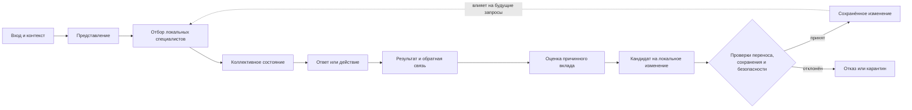
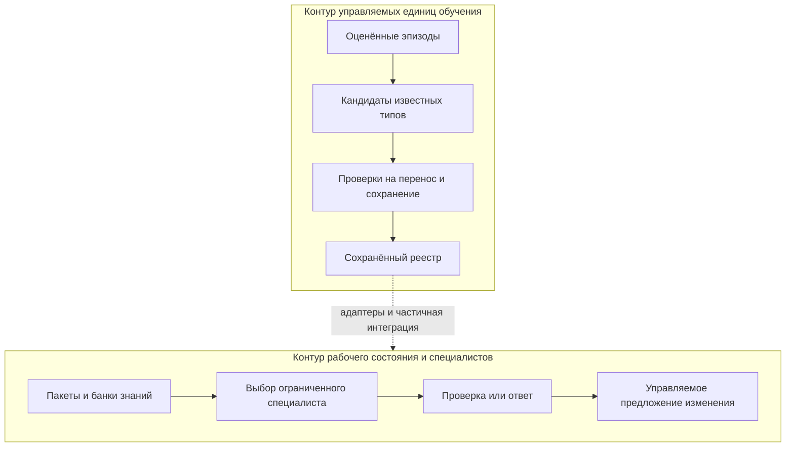

# Архитектура AAF: замысел и фактическая граница

> Здесь архитектурная идея отделена от того, что было реализовано и что было
> доказано. Схема объясняет исследование, но не является спецификацией готовой
> системы.

## Архитектура в одном рисунке



Ключевое требование — замкнуть всю петлю. Если опыт только записан, если
кандидат построил внешний разработчик или если сохранённый объект не участвует
в будущем обычном запросе, сильная гипотеза обучения не подтверждается.

## Основные сущности замысла

### Модуль или специалист

Локальный компонент, который распознаёт ограниченный тип ситуации, хранит
малую часть опыта, выдаёт локальный вклад и допускает локальное изменение.

По исходному контракту специалист не должен принимать глобальное решение,
хранить стратегию всей системы или превращаться в «мини-LLM».

### Ансамбль и коалиция

Ансамбль выбирает активные компоненты и собирает их вклады. Коалиция —
конкретный набор специалистов, активированный для одного запроса или задачи.

Слабый вариант коалиции выбирает, объединяет или проверяет уже известные
операции. Сильный вариант должен был получить новую повторно используемую
операцию, не прописанную заранее. Именно сильный вариант не был подтверждён.

### Память

В замысле память была не архивом ответов, а инфраструктурой следов опыта:
недавнего контекста, локального опыта специалистов, устойчивых карт
специализации и долговременных консолидаций.

Практическая реализация в основном пришла к версионируемым реестрам,
сохранённым пакетам, типизированным фактам и правилам жизненного цикла. Это
полезная управляемая память, но само по себе не обучение общего представления.

### Эпизод

Минимальный законченный цикл:

```text
вход → внутреннее состояние → ответ → обратная связь
     → оценка вклада → локальное изменение → сохранение или отказ
```

### Кредит

Причинная оценка вклада компонента в итог. Без неё изменение легко закрепляет
случайную корреляцию или ошибку всей цепочки не в том месте.

## Планировавшиеся слои ответственности

| Слой | Что должен был делать | Чего не должен был делать |
|---|---|---|
| Представление | Строить признаки из входа | Принимать итоговое решение или управлять обучением |
| Координация | Выбирать специалистов и собирать коллективное состояние | Скрыто решать задачу вместо специалистов |
| Политика ответа | Превращать коллективное состояние в ответ или действие | Хранить всю память и решать, что закреплять |
| Регуляция | Ограничивать деградацию, замораживать или ослаблять опасные изменения | Подменять ответ и обучение |
| Обучение | Назначать кредит, строить локальные изменения, обновлять специализацию | Быть монолитным центром знания и решений |

На ранней проверке границ отдельное кодовое воплощение имели только фактические
и управляющие роли. Самостоятельные слои регуляции и обучения оставались
архитектурным планом. Позднее их обязанности частично появились в виде
проверок, ограничителей и процедур, но это не превратило их автоматически в
независимые обучающиеся подсистемы.

## Фактическая исследовательская система

Критическая ревизия описала два частично перекрывающихся контура.



Первый контур лучше объяснял жизненный цикл кандидата. Второй был ближе к
фактическому выполнению запросов. Они не стали одной общей самообучающейся
петлёй. В критической ревизии это прямо отмечалось как незакрытый разрыв.

## Что реально поддерживали эксперименты

### Узко поддержано

- ограниченный выбор специалистов;
- сохранение версионируемых объектов;
- типизированный поиск фактов и указание их происхождения;
- проверка кандидатов на подготовленных наборах;
- удержание изменений до прохождения разрешающих условий;
- откат, карантин и фиксация конфликтов в отдельных контурах.

### Поддержано только частично

- участие сохранённых способностей в обычном рабочем запросе;
- единая семантическая обработка всех конфликтующих утверждений;
- причинная независимость результата от тестовой конструкции;
- физическое, а не только логическое разделение разрешённых и запрещённых
  изменений.

### Не поддержано

- полезное изменение общего пространства представлений;
- автономное построение формы нового навыка из произвольного опыта;
- новая операция коалиции вне заданного языка поиска;
- общее самообучение или готовность к применению.

## Почему «много компонентов» не равно «новый интеллект»

Маршрутизатор, база знаний, правила конфликтов и несколько специалистов могут
дать полезный ответ. Но результат остаётся обычной программной композицией,
если:

- доступные операции заранее перечислены;
- пространство их цепочек конечно и задано разработчиком;
- внешний генератор формирует специалистов;
- арбитр заранее определяет допустимый способ их объединения;
- улучшение существует только внутри специально подготовленного теста.

Решающая проверка проекта показала именно такой случай: найденная композиция
принадлежала заранее определённому конечному пространству цепочек. Поэтому её
нельзя считать возникновением новой операции.

## Граница ответа и безопасность

В позднем варианте предполагался консервативный порядок:

```text
сначала прежний контур
  → при его отказе сбор всех подходящих утверждений
  → разрешение семантических конфликтов
  → поиск подтверждённого факта
  → ответ либо отказ
```

Изменения знания должны были быть запрещены по умолчанию, а конфликт,
повреждение или неполная проверка — приводить к отказу. Однако поздний аудит
обнаружил реальный конфликт, прошедший через ранее «зелёную» проверку. Это
ограничило вывод: механизмы безопасности существовали, но их полнота для всего
рабочего пути доказана не была.

## Как читать архитектуру сегодня

AAF следует рассматривать в трёх разных масштабах:

1. **Как гипотезу** — попытка добиться локального, сохраняемого и совместного
   обучения поверх базовой модели.
2. **Как прототип** — набор специалистов, памяти, маршрутизации и управляемых
   проверок.
3. **Как результат исследования** — главная гипотеза не подтверждена, но
   отдельные компоненты могут оцениваться как обычные независимые инструменты.

Смешение этих масштабов и стало одной из причин завышенных промежуточных
выводов.

## Куда читать дальше

- [Идея и цели](01_IDEA_AND_GOALS.md)
- [Хронология исследования](03_RESEARCH_TIMELINE.md)
- [Словарь терминов](GLOSSARY.md)
- [Посмертный отчёт](../POSTMORTEM.md)
