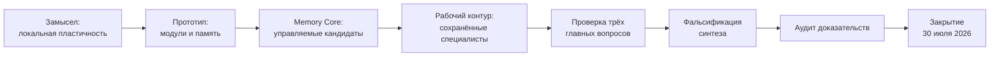

# Хронология исследования AAFvsLLM

> Это хронология изменения гипотезы и качества доказательств, а не список всех
> коммитов. Более поздняя проверка имеет приоритет над ранней формулировкой.

## Короткая карта

## Март 2026 — формулировка замысла

Проект начался с идеи машины, которая проходит цикл «опыт → результат →
локальное изменение → сохранение» и при этом не теряет старые навыки.

Были сформулированы базовые сущности:

- локальный модуль;
- ансамбль;
- рабочая память;
- законченный эпизод опыта;
- причинный кредит;
- глобальное решение, собираемое из локальных вкладов.

Критерий был сильным: система должна была не просто хранить новые факты, а
становиться лучше в будущем вычислении.

**Статус с позиции финала:** архитектурная гипотеза, а не установленное
свойство.

## Март–апрель — прототип и разделение обязанностей

Были созданы ограниченные задачи на противоречия, перефразирование,
последовательное поступление фактов, локальную коррекцию и сохранение навыков.
Одновременно архитектуру разделили на представление, координацию, политику
ответа, регуляцию и обучение.

Проверка границ от 21 апреля зафиксировала важное несоответствие: в коде
самостоятельно были представлены только фактические и управляющие роли, тогда
как отдельные слои регуляции и обучения оставались планом.

**Что это дало:** рабочие механизмы локального ремонта и сохранения на
ограниченных задачах.

**Чего это не дало:** автономного обучения и полного воплощения заявленной
слоистой архитектуры.

## Конец апреля — Memory Core V1 и V2

В первой версии Memory Core появились версионируемые записи, происхождение
знания, обработка конфликтов и жизненный цикл сохранённого объекта. Это было
названо управляемой гигиеной памяти, а не обучением.

Во второй версии исследование перешло к единицам, которые должны были менять
будущее вычисление: маршрутизацию, проверку, коррекцию и поведение. Для них
строились кандидаты, изолированные проекции, проверки на новых примерах,
сохранение или отказ.

**Сильная сторона этапа:** впервые была ясно сформулирована цепочка от опыта до
сохранённого изменения.

**Ограничение:** форма кандидатов и семейства задач в основном задавались
разработчиком заранее.

## 1–6 мая — критическая ревизия самообучения

Внутренний показатель зрелости достиг максимума на ограниченном синтетическом
наборе, хотя одновременно сообщал о незакрытом препятствии. Ревизия признала
это ошибкой измерения: насыщение подготовленного теста нельзя называть
завершённой моделью.

Отчёт этапа зафиксировал:

- 398 оценённых эпизодов;
- 5 предложенных и 5 сохранённых единиц;
- 0 постоянно продвинутых единиц в рабочий контур;
- тесты были ограниченными, подготовленными и зависели от заданных типов
  кандидатов.

Эти числа описывают внутренний этап разработки. Из-за последующего аудита
зависимости исполнителя и проверяющего они не считаются независимым
доказательством общего самообучения.

Ревизия также обнаружила два параллельных пути: контур управляемых единиц
обучения и контур фактических рабочих специалистов. Они частично соединялись,
но не образовали единой петли, где опыт самостоятельно меняет рабочую модель.

**Главный урок этапа:** память не равна обучению, а высокий внутренний балл не
равен интеллектуальной зрелости.

## Май–июль — сохранённые специалисты и V3

Следующая линия работы пыталась сделать ограниченные способности
долговременными и доступными будущим запросам. Появились версионируемые пакеты
специалистов, типизированные факты, происхождение источника, запрет постоянных
изменений по умолчанию, карантин и откат.

Пакет V3 стал важным инженерным срезом этой линии. Позднее его пришлось
восстанавливать и отдельно проверять целостность. Это показало, что
ограниченное сохранённое состояние можно упаковать и воспроизвести.

Но смысл результата был уже: V3 подтверждал существование управляемого пакета
специалистов и знаний, а не изменение общего пространства представлений.
Кроме того, поздняя проверка обнаружила утечку конфликтующего утверждения в
ответ. Поэтому V3 нельзя представлять как завершённый безопасный рабочий
профиль.

**Статус с позиции финала:** ценный ограниченный объект исследования, не новая
интеллектуальная модель.

## Июль — сведение проекта к трём решающим вопросам

После роста инфраструктуры были выделены три вопроса, без положительного
ответа на которые продолжение теряло смысл.

| Вопрос | Наблюдение |
|---|---|
| Пластичность | В чистом нейронном свидетельстве локальные и выходные параметры менялись, но embeddings не изменились; отдельного теста геометрии представлений не было, а результат на отложенной выборке снизился с 21/36 до 19/36 |
| Синтез | Заявленные композиции оказались фиксированными цепочками, выбранными из заранее записанного конечного пространства |
| Экономика | Сравнение одинакового качества и одинаковых источников против правил, RAG и дообучения не проводилось |

Снижение одного показателя не доказывает невозможность полезной пластичности
вообще. Но оно не поддерживает именно заявленную гипотезу этого проекта.

## Решающий тест синтеза

Первоначально один лабораторный результат был описан как «новая композиция».
Затем был поставлен пропущенный контроль: выразима ли найденная программа через
известные операции или их фиксированные цепочки?

Результат проверки:

- пространство содержало 39 заранее допустимых цепочек;
- все 24 заявленных составных представления принадлежали этому пространству;
- нового примитива или новой структуры программы не появилось.

Формулировка «новая композиция» была отозвана. Корректный вывод: система
выбрала подходящую фиксированную цепочку из конечного языка гипотез.

**Научный итог:** это результат обычного ограниченного синтеза программ, а не
свидетельство возникающего коалиционного интеллекта.

## Аудит конфликтов и доказательств

Параллельно обнаружился конфликтный запрос, который дал ответ там, где система
должна была отказаться. Попытка ремонта была признана недостоверной, а её
сильные классификации — отозваны. Последующий forensic-аудит сохранил
состояние, установил объём изменений и отделил исполняемые свидетельства от
итоговых деклараций.

Аудит выявил системную проблему процесса:

- один исполнитель проектировал механизм и его проверку;
- итоговые сводки иногда проверялись через другие сводки;
- количество assertions принималось за количество независимых экспериментов;
- монитор и тестовый контур могли расходиться с фактическим владельцем ответа.

После этого прежние метки успеха перестали считаться самостоятельным
источником истины.

## 30 июля 2026 — остановка программы

Проект был закрыт, потому что две центральные гипотезы — полезная общая
пластичность и новая операция коалиции — не получили поддержки, а третья,
экономическая, уже не могла восстановить исходное обещание.

Закрытие не означает, что вся инженерная работа бесполезна. Отдельно могут
исследоваться:

- типизированный поиск фактов и происхождение источников;
- сбор конфликтующих утверждений и консервативный отказ;
- версионируемые пакеты и откат;
- запрет изменений по умолчанию;
- пересчёт результатов из первичных наблюдений.

Но такие компоненты должны получать собственные имена, простые baseline и
независимые критерии. Они не наследуют сильные заявления AAF.

## Как менялся честный статус

| Фаза | Тогдашняя интерпретация | Итоговая интерпретация |
|---|---|---|
| Прототип | Самообучающаяся модульная система | Ограниченный стенд локального ремонта и памяти |
| Memory Core | Сохранённое обучение | Управляемые кандидаты на подготовленных задачах; значительная часть формы задана извне |
| V3 | Устойчивый профиль специалистов | Воспроизводимый ограниченный пакет с незакрытой безопасностью конфликтов |
| Coalition | Новая композиционная способность | Поиск фиксированной цепочки в конечном пространстве |
| Governance | Доказанная безопасность | Полезные логические ограничения без полной независимости доказательств и физической изоляции |
| Финал | Возможная новая модель | Главная гипотеза данного проекта не поддержана |

## Куда читать дальше

- [Идея и цели](01_IDEA_AND_GOALS.md)
- [Обзор архитектуры](02_ARCHITECTURE_OVERVIEW.md)
- [Словарь терминов](GLOSSARY.md)
- [Посмертный отчёт](../POSTMORTEM.md)
